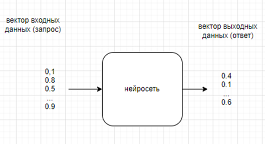
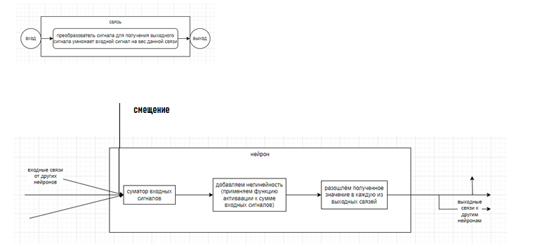
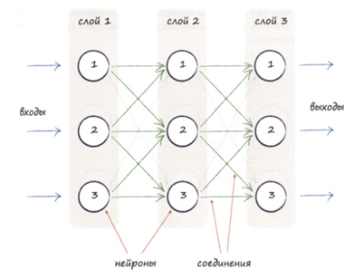
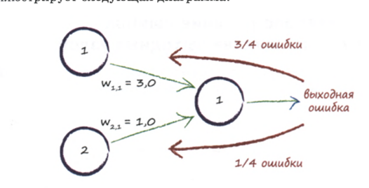

# Нейросети в целом. Записки.

### Первое что следует уяснить

Компьютерные нейросети бесконечно далеки от своих биологических аналогов. По сути, компьютерные нейросети это математические модели, то есть некий набор данных и алгоритмы их обработки.
На заре своего становления компьютерные нейросети были изначально вдохновлены своими биологическими аналогами, но и только. Более они почти никак не связаны между собой.

### Что такое нейросеть?

Если совсем кратко, то это алгоритм преобразующий вектор входных данных в вектор выходных данных. Вектор здесь это массив, иначе говоря, упорядоченная последовательность значений, где кроме самого значения также имеет значение его порядковый номер и, например, если взять и переставить местами два значения, то это будет уже совсем другая последовательность.



Интересный момент: нас не интересуют конкретные значения входных данных. Единственное что нас интересует это сохранение отношений между ними.

Например, входной вектор 20, 25, 29 эквивалентен вектору 10, 15, 19 и также эквивалентен вектору 20/29, 25/29, 29/29 что примерно равно 0.69, 0.86, 1.0

Потому, что задача нейросети как раз найти скрытые закономерности между входными данными и выходными на множестве известных примеров чтобы потом суметь вычислить выходной вектор на основе входных данных, для которых неизвестен ответ.

Исключительно для удобства вычислений примем что значения входных и выходных данных лежат в диапазоне от -1 до 1. Данное допущение нисколько и ни в чём нас не ограничивает так. Ещё раз уточню, что мы всегда можем любой набор данных привести к диапазону от 0 до 1, например, просто поделив каждое значение на максимальное.

### Из чего состоит нейросеть?

В биологии каждый нейрон это отдельный вычислитель. Мы могли бы представить его в виде отдельного потока выполнения, если бы это не было слишком медленно в реальной реализации на последовательном процессоре. Поэтому нейрон можно представлять как объект и алгоритм последовательно пробегает по нейронам производя вычисления для каждого из них (это рабочий, но медленный подход. В современных решениях нейроны объединяются в слои, а те, в свою очередь, представляются матрицами входящих и исходящих из нейронов связей. Таким образом появляется возможность свести процесс работы и обучения нейросети к матричным вычислениям что резко ускоряет алгоритм).

Итак: нейрон это математическая модель. Маленький кирпичик из совокупности которых и, главное, связей между ними, рождается более сложная математическая модель называемая слоем, а уже из совокупности слоёв рождается ещё более сложная модель называемая нейросетью.

Обычно выделяют четыре вида нейронов: входной, выходной, скрытый и нейрон смещения. Но, по сути, это один и тот же нейрон. Разве только входной нейрон и нейрон смещения не имеют входных связей. Нейрон смещения дополнительно, в отличии от входного нейрона, имеет некоторое постоянное значение, генерируемое им. Выходной нейрон не имеет исходящих связей.

Итак, наша нейросеть состоит из объектов следующих видов:

* Связь между двумя нейронами. 
* Нейрон 
* Слой. Совокупность нейронов обрабатываемых на одном шаге параллельно.



Собственно: нейросеть это веса связей и ничего больше. В них хранятся её опыт и память, и способность решать задачи.

## Полносвязанные нейросети (MLP)

Это такие нейросети где каждый нейрон предыдущего слоя связан только с каждым нейроном последующего слоя.



Причины популярности полносвязанных сетей:

* Вычислительная эффективность. Операция полносвязного слоя может быть представлена как умножение матриц. Это одна из самых оптимизированных операций в вычислительной технике, особенно на GPU. Если бы связи были произвольными, мы не смогли бы так эффективно использовать параллельные вычисления. Из-за полносвязанности нейроны слоя могут обрабатыватья паралельно.
* Иерархическое представление признаков: Это ключевая идея глубокого обучения. Каждый слой учится комбинировать признаки предыдущего слоя, чтобы получать более сложные и абстрактные представления. 

```
        Слой 1: Распознает простые элементы: края, углы.
        Слой 2: Комбинирует края в более сложные формы: геометрические фигуры.
        Слой 3: Комбинирует формы в части объектов (нос, глаза для лица).
        Слой 4: Распознает целые объекты (лицо, кошка, автомобиль).
```

Прямые связи только между соседними слоями идеально подходят для построения такой иерархии.


**Прямой проход (прямое распространение сигнала)** это процесс работы нейросети. То есть мы даём ей входной вектор данных и получаем на выходе выходной вектор.

**Обратный проход (обратное распространение ошибки)** это процесс обучения нейросети. Обучение нейросети сводится к корректировке веса её связей между нейронами. Обратный проход всегда выполняется строго после прямого прохода. Имея выходной – выданный нейросетью вектор данных мы можем сравнить его с правильным (процесс обучения с учителем), посчитать ошибку для каждого выходного нейрона как разницу между тем что он выдал и правильным ответом и дальше эта ошибка распространяется обратно по нейросети слой за слоем корректируя сначала веса нейронов связанных с выходным, потом нейронов которые связаны уже с этими нейронами и так далее вплоть до нейронов входного слоя.

Выше я описал нейронную сеть как инструмент, который ищет корреляцию между входным и выходным наборами данных. Теперь я хочу немного уточнить это описание. В действительности нейронные сети ищут корреляцию между своими входным и выходным слоями. Вы определяете отдельные строки из входных данных как значения входного слоя и пытаетесь обучить сеть так, чтобы ее выходной слой совпал с выходным набором данных. Как ни странно, но нейронная сеть ничего не знает о данных на которых обучается. Она просто ищет корреляцию между входным и выходным слоями.

## Алгоритмы

### Прямой проход

Основная идея: имея вектор входных данных получить вектор выходных данных

1. Для входного слоя. Установить выходное значение нейронов в вектор входных данных
```java
/**Прямой проход для нейронов слоя (вычисление)
 * @param input - вектор входных данных*/
public void forward(double[] input){
    assert (input.length!=neirons.size()) : "Несовпадение размерности";

    for(int i=0; i<input.length; i++)
        neirons.get(i).oValue = input[i];
}
```
2. Далее каждого слоя кроме входного последовательно. 

Для каждого нейрона:
+ Подсчитать суммарный входной сигнал по всем входящим в него связям, включая смещение.
+ Вычислить исходящее значение нейрона как результат применения функции активации к суммарному входному значению нейрона

Примечание: Значение сигнала полученное по входящей в нейрон связи это значение сигнала переданное нейроном из прошлого слоя умножимое на вес связи

```java
        /**Прямой проход для нейронов слоя (вычисление)*/
        public void forward(){
           for(Neiron neiron : neirons) {
               neiron.iValue = neiron.bias;
               for (Link link : neiron.iLinks)
                   neiron.iValue += link.iNeiron.oValue * link.weight;
               neiron.oValue = activation.apply(neiron.iValue);
           }
        }
```
3. Для нейронов выходного слоя выполняем то же самое, плюс составляем из их выходных значений neiron.oValue вектор ответа

```java
С точки зрения нейросети бежим по слоям от входного до выходного

    /**Прямое распространение сигнала (вычисление)
     * @param inputs - вектор входных значений
     * @return -вектор выходных значений*/
    public double[] forward(double[] inputs){
        ((Layer.input)layers.getFirst()).forward(inputs);

        for (int i=1; i<layers.size()-1; i++)
            ((Layer.medium)layers.get(i)).forward();

        return ((Layer.output)layers.getLast()).forward();
    }
```

Формулы:

Выход единичного нейрона вычисляется по формуле y = f(w1*x1 + w2*x2 + ... + wn*xn + b)

где:
* x1...xn — входы (то есть выходы предыдущего слоя)
* w1...wn — веса входов (входных свящей)
* b — смещение (bias)
* f — функция активации (например, сигмоида, ReLU)

В матричном представлении

Если
* n — это количество входов для слоя (размерность входного вектора, он же размер предыдущего слоя).
* m — это количество нейронов в текущем слое (размерность его выхода).

Матричное представление одного слоя размерности n связанного со следующим слоем размерности m:
* Входы как вектор-столбец X размерности (n, 1)
* Смещения как вектор-столбец b размерности (m, 1)
* Веса связей между нейронами предыдущего слоя (размерности n) и нейронами нашего слоя(размерности m) как матрицу W размерности (m, n). Каждая i-я строка матрицы W — это вектор весов для i-го нейрона текущего слоя

Тогда выход нашего слоя (то есть вход для следующего слоя) будет

A=f(W * X + b)

Размерность A: (m, n) * (n, 1) + (m, 1) = (m, 1) 

Допустим, у нас 2 входа (x1, x2) и слой из 3 нейронов
```
    X = [ [x1],
          [x2] ]
    b = [ [b1],
          [b2],
          [b3] ]
    W = [ [w11, w12],   <- веса 1-го нейрона
          [w21, w22],   <- веса 2-го нейрона
          [w31, w32] ]  <- веса 3-го нейрона
          
Тогда вычисляем
    Z = W * X + b = [ [w11*x1 + w12*x2 + b1],
                      [w21*x1 + w22*x2 + b2],
                      [w31*x1 + w32*x2 + b3] ]

    A = f(Z)
```

### Обратное распространение ошибки

Основные термины
* Ошибка - разница между ожидаемым и полученным значением нейрона выходного слоя
* Дельта ошибки - чувствительность ошибки к внутренним параметрам нейрона. Это частная производная ошибки по взвешенной сумме входов этого нейрона. Она показывает, насколько изменится общая ошибка сети, если немного изменить входной сигнал этого нейрона (до активации).
* Градиент (∇) по весам (или смещениям) - Вектор, указывающий направление наискорейшего роста функции ошибки относительно конкретного веса (или смещения). На практике нас интересует его отрицательное направление для уменьшения ошибки. Вычисляется из дельты ошибки
* Алгоритм обратного распространения ошибки - метод для вычисления вектора градиента ошибки — указатель, показывающий направление и величину роста ошибки для каждой входной связи данного нейрона.
* Градиентный спуск - общий алгоритм оптимизации, который использует градиент для минимизации функции (в нашем случае функция это ошибка нейрона. Параметрами функции выступают значения пришедшие по входным связям нейрона)
* Функция потерь - функция, которая измеряет, насколько выход сети отличается от правильного ответа.

Производная - скорость изменения функции. Тоже самое что и градиент
  
Градиентный спуск — это общая стратегия минимизации ("куда и как шагать?"). Алгоритм обратного распространения ошибки — это специфическая техника для реализации этой стратегии в нейронных сетях, которая решает проблему эффективного вычисления градиента для большого количества параметров.

Чтобы воспользоваться методом градиентного спуска, нам нужно определить наклон функции ошибки по отношению к весовым коэффициентам.

Основные идеи:
* Суть обучения заключается в определении правильного направления и величины изменения веса для уменьшения ошибки.
* Зная целевой выходной вектор и тот, который выдала нейросеть мы можем подсчитать насколько ошибся каждый нейрон выходного слоя.
Это называется обучением с учителем. Зная насколько ошибся данный нейрон выходного слоя мы можем посчитать его ошибку.
Нейрон выходного слоя имеет входящие связи и нам надо распределить ошибку по ним согласно их вкладу (то есть сигналу который пришёл по каждой из входящих связей). Также нам нужно будет откоректировать вес этих связей чтобы уменьшить ошибку на выходном нейроне.
* То есть, зная ошибку на выходном нейроне нам нужно распределять ошибку между узлами предыдущего слоя, однако это распределение не обязано быть равномерным. Вместо этого большая доля ошибки приписывается вкладам тех связей, которые имеют больший вес (точнее сигнал = вес * переданное_значение). Почему? Потому что они оказывают большее влияние на величину ошибки.
```java
        /**Вычислить дельту ошибки для выходного нейрона на основе разницы между ожидаемым и полученным значениями
         * @param neiron - нейрон для которого вычисляем дельту ошибки
         * @param target - целевое(ожидаемое) значение нейрона*/
        protected void calcDelta(Neiron neiron, double target) {
            //дельта ошибки на выходе нейрона = производная функции потерь * производная функции активации
            neiron.delta=derivativeLoss.apply(neiron.oValue, target) * derivative.apply(neiron.iValue, neiron.oValue);
        }
        
        в рамках данного кода вычисляется не чистая дельта ошибки а градиент ошибки включающий в себя дельту ошибки и активацию е
```
* Относительно нейронов промежуточных слоёв мы не можем напрямую вычислить ошибку нейрона. Мы должны вычислять её как сумму ошибок всех нейронов следующего слоя с которыми связанн данный нейрон в соответствии с весом связей
```java
        /**Распространить дельту ошибки (Вычислить на основе уже известных дельт ошибок нейронов следующего слоя с которыми он связан)
         * @param neiron - нейрон для которого вычисляем дельту ошибки*/
        protected void calcDelta(Neiron neiron) {
            double sum = 0F;
            for (Link outLink : neiron.oLinks)
                sum += outLink.oNeiron.delta * outLink.weight;
            neiron.delta = derivative.apply(neiron.iValue, neiron.oValue) * sum;
        }
        
        где derivative это производная функции активации
```



* Получив вектор градиента, который указывает направление роста ошибки, алгоритм делает шаг в противоположном направлении (потому что мы хотим ошибку уменьшить). Размер этого шага определяется скоростью обучения (learning rate). И корректирует вес связи

Таким образом, алгоритм обратного распространения ошибки сводится к следующему:

```
Ошибка вычисляется на выходном слое.
Затем она распространяется назад: от выходного слоя к входному.
Каждый нейрон (кроме входных) имеет дельту (δ), которая показывает, насколько он виноват в ошибке.

Layer.output.backward:
        - вычисляет дельту для каждого нейрона выходного слоя на основе разницы между целевыми и полученными данными
        - обновляет веса входящих связей (iLinks) этих нейронов.
Layer.medium.backward:
        - вычисляет дельту для каждого нейрона скрытого слоя (используя дельты следующего слоя и веса исходящих связей).
        - обновляет веса входящих связей (iLinks) этих нейронов.
Layer.input.backward:
        - Входной слой не имеет входящих связей, а его исходящие связи (oLinks) уже обновлены на предыдущем шаге. Ничего не делаем
```


```java
        /**Обратное распространение ошибки (корректировка весов). Может запускаться только после выполнения прямого распространения
         * @param target - вектор целевых значений выходных нейронов (для выходного слоя) или пусто для промежуточного слоя*/
        public void backward(double[] target){
            for(int i=0; i<neirons.size(); i++) {
                 Neiron neiron = neirons.get(i);

                 /**Вычислим дельту ошибки для нейронов текущего слоя*/
                 
                 /*Если это выходной слой то вычислим дельту ошибки для выходного нейрона на основе разницы между ожидаемым и полученным значениям
            //дельта ошибки на выходе нейрона = производная функции потерь * производная функции активации
            neiron.delta=derivativeLoss.apply(neiron.oValue, target[i]) * derivative.apply(neiron.iValue, neiron.oValue);                         
                  */
                
                /*Если это промежуточный слой то протащим дельту ошибки (вычислим для нейронов текущего слоя на основе уже известных дельт ошибок нейронов следующего слоя)
            double sum = 0F;
            for (Link outLink : neiron.oLinks)
                sum += outLink.oNeiron.delta * outLink.weight;
            neiron.delta = derivative.apply(neiron.iValue, neiron.oValue) * sum;                        
                 */

                /**На основе дельты ошибки скорректируем вес входящих в нейрон связей, включая смещение нейрона*/
                
                //корректируем вес смещения для нейрона
                neiron.bias = neiron.bias - learningRate * neiron.delta; //производная по bias равна delta (так как bias влияет напрямую на iValue)

                //корректируем веса входящих связей для нейрона
                for (Link inLink : neiron.iLinks){
                    double grad = inLink.iNeiron.oValue * neiron.delta;
                    inLink.weight = inLink.weight - learningRate * grad;
                }
            }
        }
```

### Обучение нейросети

Тренировка заключается в последовательном прямом и обратном проходах для каждого примера из набора и повторение таких проходов пока не будет достигнута треубемая точность прогноза или точность не перестанет повышаться

см модуль Train.java

### Вопросы и ответы

см [Нелинейность и ReLU в нейросетях - DeepSeek.mhtml](%D0%9D%D0%B5%D0%BB%D0%B8%D0%BD%D0%B5%D0%B9%D0%BD%D0%BE%D1%81%D1%82%D1%8C%20%D0%B8%20ReLU%20%D0%B2%20%D0%BD%D0%B5%D0%B9%D1%80%D0%BE%D1%81%D0%B5%D1%82%D1%8F%D1%85%20-%20DeepSeek.mhtml)
зачем нужна нелинейность в функции активации нейронов нейроной сети и каким требованиям должны удовлетворять функции активаци ии можно ли сделать нейросеть из одних только relu-функций и будет ли она работать?

[Дельта и градиент в обратном распространении - DeepSeek.mhtml](%D0%94%D0%B5%D0%BB%D1%8C%D1%82%D0%B0%20%D0%B8%20%D0%B3%D1%80%D0%B0%D0%B4%D0%B8%D0%B5%D0%BD%D1%82%20%D0%B2%20%D0%BE%D0%B1%D1%80%D0%B0%D1%82%D0%BD%D0%BE%D0%BC%20%D1%80%D0%B0%D1%81%D0%BF%D1%80%D0%BE%D1%81%D1%82%D1%80%D0%B0%D0%BD%D0%B5%D0%BD%D0%B8%D0%B8%20-%20DeepSeek.mhtml)
связь дельты ошибки и градиента по весу

мысль по распараллеливанию вычислений 
* можно распараллеливать вычисления на пачках нейронов в пределах одного слоя. См [AsyncNeirons.java.txt](../stabile/async/AsyncNeirons.java.txt)
* можно распараллеливать обучение на примерах в пределах одной эпохи. Во всех процессах устанавливается общее состояние нейросети, в каждом процессе обучается своя пачка и потом все изменения веса усредняются перед записью в нейросеть.

см [Оптимизаторы весов нейросетей - DeepSeek.mhtml](%D0%9E%D0%BF%D1%82%D0%B8%D0%BC%D0%B8%D0%B7%D0%B0%D1%82%D0%BE%D1%80%D1%8B%20%D0%B2%D0%B5%D1%81%D0%BE%D0%B2%20%D0%BD%D0%B5%D0%B9%D1%80%D0%BE%D1%81%D0%B5%D1%82%D0%B5%D0%B9%20-%20DeepSeek.mhtml)
для оптимизаторов весовых коэффициентов

см [Понимание функции потерь и производной - DeepSeek.mhtml](%D0%9F%D0%BE%D0%BD%D0%B8%D0%BC%D0%B0%D0%BD%D0%B8%D0%B5%20%D1%84%D1%83%D0%BD%D0%BA%D1%86%D0%B8%D0%B8%20%D0%BF%D0%BE%D1%82%D0%B5%D1%80%D1%8C%20%D0%B8%20%D0%BF%D1%80%D0%BE%D0%B8%D0%B7%D0%B2%D0%BE%D0%B4%D0%BD%D0%BE%D0%B9%20-%20DeepSeek.mhtml)
про функцию потерь и её производную которая нужна в градиентном спуске
